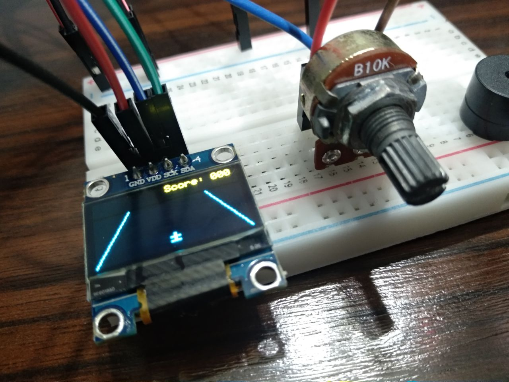

# esp32-mini-game

## Descrição

Neste projeto, montei e programei um minigame do zero.

## Componentes

- Placa ESP32
- Visor OLED
- Potenciômetro 10k
- Buzzer

## Referências

- https://randomnerdtutorials.com/esp32-adc-analog-read-arduino-ide/
- https://randomnerdtutorials.com/esp32-ssd1306-oled-display-arduino-ide/
- https://techtutorialsx.com/2017/07/01/esp32-arduino-controlling-a-buzzer-with-pwm/

